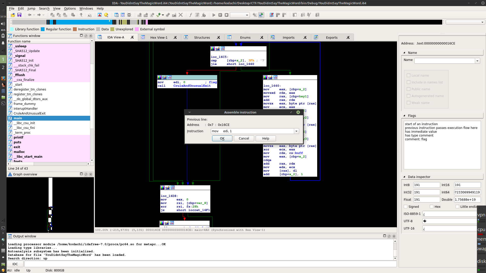
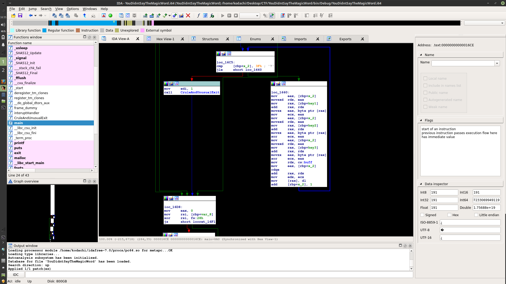
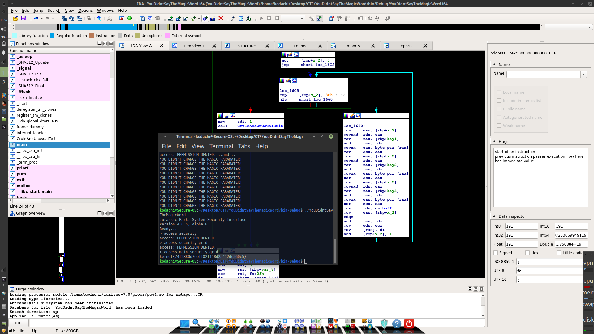

# Ah ah ah, You didnt say the magic word

**Start by watching the video**

By watching the video you would know exactly what must be done to get the next hint in the challange. at that point you should realize that you must start looking at the different parameters being given to each function call, the call to CruleAndUnusualExit should strike your eye.

<figure style="width: 240px">
	
  <caption>CruleAndUnusualExit</caption>
</figure>

obviously the argument is 0. ask yourself, What would happen if it's not zero. the answer is you get your flag. 

if your using IDA pro, put your cursor on **mov edi, 0** goto **edit/Assemble** and change it to **mov edi,1**

<figure style="width: 240px">
	
  <caption>patching</caption>
</figure>

if your using IDA pro you may now apply that patch by going to **Edit/Patch Program/Apply Patches to Input File**

your binary should now look as follows: 

<figure style="width: 240px">
	
  <caption>patched</caption>
</figure>

Run the program again and do what you did earlier, you will retrieve your Kernel flag

<figure style="width: 240px">
	
  <caption>Congratulations</caption>
</figure>
