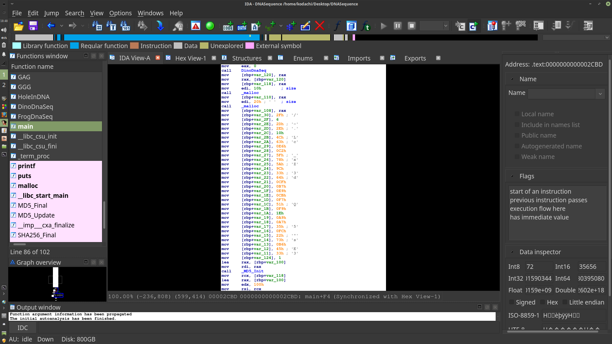
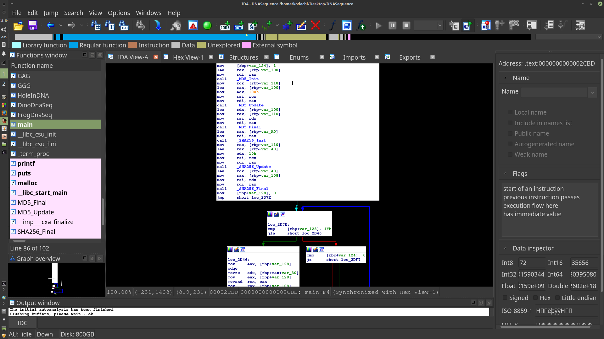
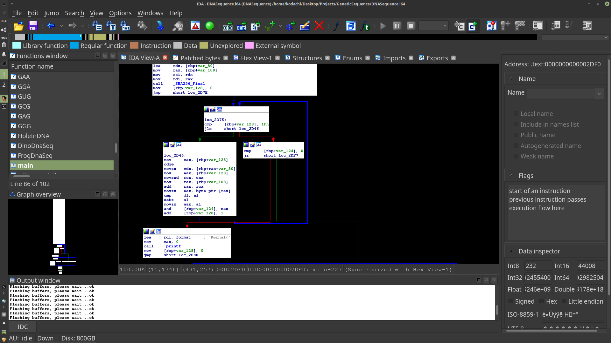
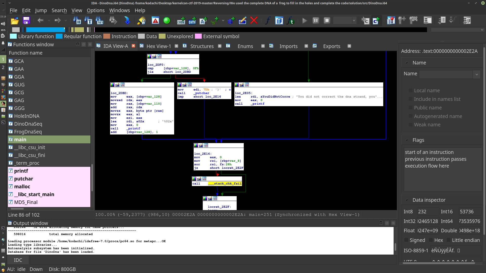
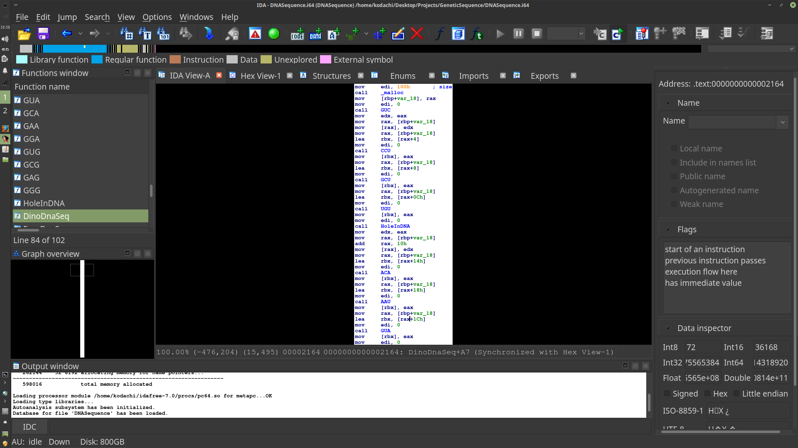
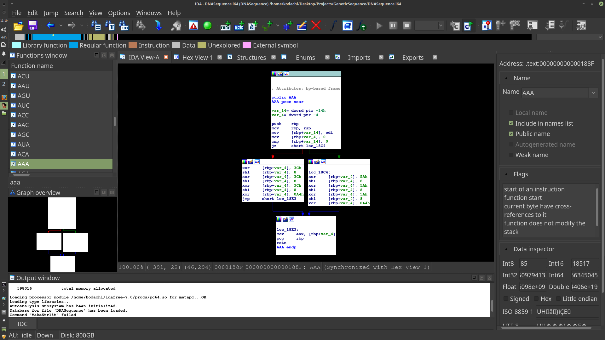
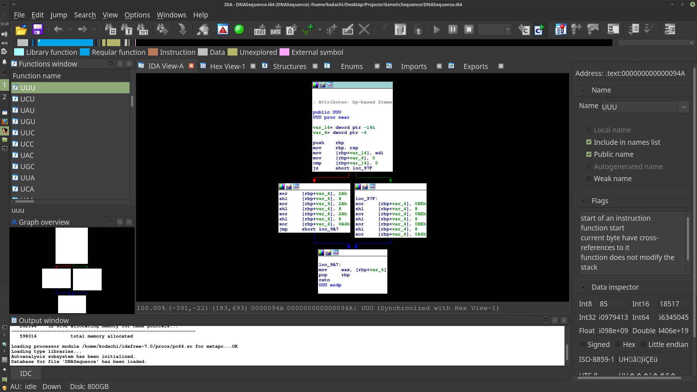

# We used the complete DNA of a frog to fill in the holes and complete the code.

**Getting Started**
To start let's go ahead and grow "DNASequence" into IDA(or a similar reversing tool). 

Best practice is to start with main and work outwards from there, so let's start there. 

**Main**

When you first open the control flow diagram you should find the sha256 signature of the MD5 you'r looking for, so go ahead and get that written down.
f

e<figure style="width: 100px">0v 	
	<caption></caption>
</figure>

		   const unsigned char ShaKey[] = {0x2f,0x6,0x2d,0x2e,0x10,0x4c,0x63,0xe6,0xc2,0x5f,0x78,0x5a,0x9c,
     0x33,0x64,0xcf,0xb7,0xe9,0xcb,0xf7,0x51,0xf9,0x1e,0xa9,0xa7,0x35,0xfc,0x22,0x73,0xb6,0x45,0x33};

[**NOTE:** keep in mind that ShaKey is [rdb + var_30] **]**
    
You should also notice the three function calls that occur before the shaKey is set. one is to DinoDnaSeq, and the other two are memory allocations. The first allocation is for 10h(16) bytes, the next one is for 20h(32) bytes, immediately following the shaKey we have 

		mov [rbp+var_124], 1
	
so we know we have some variable that is set to 1; its likely an integer.

**So Let's look at what we think the code should look like now**
		
		uint8_t* md5key = (uint8_t*)malloc(16); 
		uint8_t* shaKey2 = (uint8_t*)malloc(32);
		//just trust me on the naming convention all will be revealed shortly. 
		const uint8_t char ShaKey[] = {0x2f,0x6,0x2d,0x2e,0x10,0x4c,0x63,0xe6,0xc2,0x5f,0x78,0x5a,0x9c,
     0x33,0x64,0xcf,0xb7,0xe9,0xcb,0xf7,0x51,0xf9,0x1e,0xa9,0xa7,0x35,0xfc,0x22,0x73,0xb6,0x45,0x33};
		int c = 1; 
		
Working under the assumption that this is correct, let's move on to the next section of disassembly.

<figure style="width: 100px">
	
	<caption></caption>
</figure>

  
**We now know that there is a call to _MD5_Init  and _SHA256_Init** so there is likely a crypto library used. Going to the functions list you can see that it is an extern function,and doing some research you could likely find a number of cryptographic librarys with  MD5_Init, MD5_Update, and, MD5_Final extern functions that you could include. For this solution I'm going to use OpenSSL, So in the header you should add:
		
		#include <openssl/md5.h>
		/*The same is true for the Sha256 functions*/
		#include <openssl/sha256>
		
**Now** we also need to declare a couple of variables that we know exist for the MD5 and SHA256 functions to work. 
What we should have now is: 

		uint8_t* md5key = (uint8_t*)malloc(16);
		uint8_t* shaKey2 = (uint8_t*)malloc(32);
	   	const uint8_t ShaKey[] = {0x2f,0x6,0x2d,0x2e,0x10,0x4c,0x63,0xe6,0xc2,0x5f,0x78,0x5a,0x9c,
     0x33,0x64,0xcf,0xb7,0xe9,0xcb,0xf7,0x51,0xf9,0x1e,0xa9,0xa7,0x35,0xfc,0x22,0x73,0xb6,0x45,0x33};
		int c = 1;
		
    		SHA256_CTX shactx;
		MD5_CTX md5ctx; 
		
Let's skip over disassembling the Init function, since it's fairly trivial. Let's instead **Analyze the call to MD5_Update!** 

You will notice from the dissassembly that this function takes three paramaters.
	
		mov rcx, [rdp + var_118] ;this moves a pointer to a "for now unknown buffer" to rcx
		lea rax, [rbp + var_100] ;move a pointer from md5ctx into rax
		mov rdx, 100h ;the buffer being hashed is 256 bytes in length 

This translates into the function call:

		MD5_Update(&md5ctx, ? , 256);
	
Which would lead us to ask what's at the questionmark? well to answer that you have to look at DinoDnaSeq and realize it is returning a pointer to some uint32_t buffer; (yes i'm jumping ahead of myself to make a more thorough solution, but it would not take long to deduce that while dissassembling, but for now we will assume blindly);

now let's see what things might look like
		
		uint32_t* DNAbuffer = DinoDnaSeq();
		uint8_t* md5key = (uint8_t*)malloc(16);
		uint8_t* shaKey2 = (uint8_t*)malloc(32);
	   	const uint8_t ShaKey[] = {0x2f,0x6,0x2d,0x2e,0x10,0x4c,0x63,0xe6,0xc2,0x5f,0x78,0x5a,0x9c,
     0x33,0x64,0xcf,0xb7,0xe9,0xcb,0xf7,0x51,0xf9,0x1e,0xa9,0xa7,0x35,0xfc,0x22,0x73,0xb6,0x45,0x33};
     		int c = 1
    		SHA256_CTX shactx;
		MD5_CTX md5ctx; 
		
		MD5_Init(&md5ctx);,
		MD5_Update(&md5ctx, (const void*)DNAbuffer,256);

**Next we see the MD5_Final called with two params**

		lea  rdx, [rbp+var_100] ; &md5ctx
		mov  rax; [rdp+var_110] ; md5key

This call sets the md5key to the md5 digest of the DNAbuffer. **This is very simular to what you would do for the sha256** So I'm just going to write those instructions down to save you from a repetitive explanation. 

		uint32_t* DNAbuffer = DinoDnaSeq();
		uint8_t* md5key = (uint8_t*)malloc(16);
		uint8_t* shaKey2 = (uint8_t*)malloc(32);
	   	const uint8_t ShaKey[] = {0x2f,0x6,0x2d,0x2e,0x10,0x4c,0x63,0xe6,0xc2,0x5f,0x78,0x5a,0x9c,
     0x33,0x64,0xcf,0xb7,0xe9,0xcb,0xf7,0x51,0xf9,0x1e,0xa9,0xa7,0x35,0xfc,0x22,0x73,0xb6,0x45,0x33};
     		int c = 1
    		SHA256_CTX shactx;
		MD5_CTX md5ctx; 
		MD5_Init(&md5ctx);,
		MD5_Update(&md5ctx, (const void*)DNAbuffer,256);
	
		MD5_Final(md5key, md5key);
		
		/* hash the md5 to sha256*/
		SHA256_Init(&shactx);
		SHA256_Update(&shactx,md5key,16);
		SHA256_Final(shakey2 , &shactx);
		
**Next we enter some fairly trivial logic!**

<figure style="width: 100px">
	
	<caption></caption>
</figure>
		
**right off the back** we see the instruction 

		mov	[rdp+var_128], 0
		jmp 	short lo_2d7e
		
		;break in control flow diagram
		
		cmp	[rdp+var_128], 1fh
		jle 	short loc_2d46
		
If we follow the looping structure on the left side we see the bottom instruction is:

		add [rdp+var_128], 1
	
This should instantly indicate **for loop** 

		
		for(x = 0; x < 32 ; x++)
		{
			// logic goes here
		}
		
Now its just a matter of reversing the little body of code in the loop

		mov     eax, [rbp+var_128]	; store the value of x in eax	
		cdqe				;convert eax to rax
		movzx   edx, [rbp+rax+var_30] 	; shaKey[x] and store it in edx
		mov     eax, [rbp+var_128]	; store the value of x in eax
		movsxd  rcx, eax 		;convert x and move to rcx;
		mov     rax, [rbp+var_108]	;dereference sha256 key memory offset;
		add     rax, rcx		; get *(shakey2+x)
		movzx   eax, byte ptr [rax]	; ignore 
		cmp     dl, al			; compare shaKey[x] to (shakey2+x)
		setz    al			; get result of cmp;
		movzx   eax, al			; store result from cmp in eax
		and     [rbp+var_124], eax	; c &= eax
		
The body of this loop is easy enough, let's get the code for what we think main should look like curently!

		SHA256_CTX shactx;		uint32_t dna;

		int c = 1;
		uint32_t* DNAbuffer = DinoDnaSeq();
    		SHA256_CTX shactx;
		MD5_CTX md5ctx
		uint8_t* md5key = (uint8_t*)malloc(16);
		uint8_t* shakey2 = (uint8_t*)malloc(32);
	   	const uint8_t ShaKey[] = {0x2f,0x6,0x2d,0x2e,0x10,0x4c,0x63,0xe6,0xc2,0x5f,0x78,0x5a,0x9c,
     0x33,0x64,0xcf,0xb7,0xe9,0xcb,0xf7,0x51,0xf9,0x1e,0xa9,0xa7,0x35,0xfc,0x22,0x73,0xb6,0x45,0x33};
    		SHA256_CTX shactx;
		MD5_CTX md5ctx; 
		MD5_Init(&md5ctx);
		MD5_Update(&md5ctx, (const void*)DNAbuffer,256);
		MD5_Final(md5key, md5key);
		SHA256_Init(&shactx);
		SHA256_Update(&shactx,md5key,16);
		SHA256_Final(shakey2 , &shactx);
		
		for(x=0;x<32;x++)
			c&=(shakey[x] == *(shakey2+x);
		
Following the exit case we find two instructions 
		
		cmp     [rbp+var_124], 0 ;compare c to 0;
		jz      short loc_2DtF7	 ;jump if equal 0 to loc_2d57
		

		
Fairly straight forward, we have an if statement here that's doing something. loc_2d57 is probably an else case. 
)
		{
		if(c
			//logic goes here
		}
		else
		{
		
		}
		Y
**Moving down a little in the disassembly** you should get something that looks like the following:

	
	<caption></caption>
</figure>

First off let's focus on the last function call we were focusing on, **loc_2d57**
:		lea     rdi, aYouDidNotCorre ; "You did not correct the dna strand, you"...
		call    _puts
		
**hmm, maybe the bad branch you could really put any failed message here**

well, what do we have now before we get to far ahead of ourselves:

		if (c)
		{
			//logic goes here
		}
		else
		{
			printf("well that didn't work");
		}
Let's go look at the other branch, since that's probably where the solution resides, at least that should be where the kernel is printed out:
	
	'	lea     rdi, format; "Kernel{"  ; this is good
		mov     eax, 0			; 0 out eax, no paramaters to printf besides the format
		call    _printf			; and we print "Kernel{" aweme
		mov     [rbp+var_128], 0 	; set x to 0;wso
		jmp     short loc_2DE0		; and we jump to another block
So we get a print statement in but there is still a little more logic to follow
		
		if (c)
		{
			printf("Kernel{");
			
			//logic goes here
		}
		else
		{
			printf("well that didnt work");
		}
		
so we jumped to loc_2DE0:

	cmp     [rbp+var_128], 0Fh
	jle     short loc_2DAD
	
The last instruction in loc_2DAD is 

	add     [rbp+var_128], 1
	
so this should instantly be identifiable as a for loop; starting at 0 and going to 15.

	for (x=0; x<=15; x++)
	{
		//logic goes here
	}
so that means our main should look something like 

		uint32_t dna;
		SHA256_CTX shactx;
		int c = 1;
		uint32_t* DNAbuffer = DinoDnaSeq();
    		SHA256_CTX shactx;
		MD5_CTX md5ctx
		uint8_t* md5key = (uint8_t*)malloc(16);
		uint8_t* shakey2 = (uint8_t*)malloc(32);
	   	const uint8_t ShaKey[] = {0x2f,0x6,0x2d,0x2e,0x10,0x4c,0x63,0xe6,0xc2,0x5f,0x78,0x5a,0x9c,
     0x33,0x64,0xcf,0xb7,0xe9,0xcb,0xf7,0x51,0xf9,0x1e,0xa9,0xa7,0x35,0xfc,0x22,0x73,0xb6,0x45,0x33};
    		SHA256_CTX shactx;
		MD5_CTX md5ctx; 
		MD5_Init(&md5ctx);
		MD5_Update(&md5ctx, (const void*)DNAbuffer,256);
		MD5_Final(md5key, md5key);
		SHA256_Init(&shactx);
		SHA256_Update(&shactx,md5key,16);
		SHA256_Final(shakey2 , &shactx);
		
		for(x=0;x<32;x++)
			c&=(shakey[x] == *(shakey2+x);
		if (c)
		{
			printf("Kernel{");	
			for (x=0; x<=15; x++)
			{
				//logic goes here
			}
		}
		else
		{
			printf("well that didnt work");
		}
		
**now what logic goes in our loop** 

		mov     eax, [rbp+var_128]  	; mov the value of x to eax 
		movsxd  rdx, eax	   	; convert eax and mov to edx.
		mov     rax, [rbp+var_110]  	; point to the first byte in the md5key
		add     rax, rdx	    	; *(md5key+x)	
		movzx   eax, byte ptr [rax]	; mov the byte ptr from rax to eax;cr
		movzx   eax, al			; ignore	
		mov     esi, eax		; move eax into esi
		lea     rdi, a02x   ; "%02x"   ; print formatter
		mov     eax, 0			; set args for printf
		call    _printf			; call printf with format %x and byte stored in esi
		
and that looks like we printed the kernel to the screen, the next block should just print the ending "}" and that's just an educated guess to make.

	
		uint32_t dna;
		SHA256_CTX shactx;
		int c = 1;
		uint32_t* DNAbuffer = DinoDnaSeq();
    		SHA256_CTX shactx;
		MD5_CTX md5ctx
		uint8_t* md5key = (uint8_t*)malloc(16);
		uint8_t* shakey2 = (uint8_t*)malloc(32);
	   	const uint8_t ShaKey[] = {0x2f,0x6,0x2d,0x2e,0x10,0x4c,0x63,0xe6,0xc2,0x5f,0x78,0x5a,0x9c,
     0x33,0x64,0xcf,0xb7,0xe9,0xcb,0xf7,0x51,0xf9,0x1e,0xa9,0xa7,0x35,0xfc,0x22,0x73,0xb6,0x45,0x33};
    		SHA256_CTX shactx;
		MD5_CTX md5ctx; 
		MD5_Init(&md5ctx);
		MD5_Update(&md5ctx, (const void*)DNAbuffer,256);
		MD5_Final(md5key, md5key);
		SHA256_Init(&shactx);
		SHA256_Update(&shactx,md5key,16);
		SHA256_Final(shakey2 , &shactx);
		
		for(x=0;x<32;x++)
			c&=(shakey[x] == *(shakey2+x);
		if (c)
		{	
			printf("Kernel{");
			for(x=0;x<=15;x++)
			{
			    printf("%02x",*(buff+x));
			}
			printf("}");
		}'
		else
		{
			prin'tf("well that didnt work");
		}

please note that without the correct sha key you cannot be sure your kernel is correct. 

### working outwards to DinoDna

**We should remember what we're doing, in fact the title tells you all you should need to solve this problem**

**So looking at this function**

<figure style="width: 100px">
	
  <caption>AAA Sequence</caption>
</figure>

The first thing we should notice is:
		
		var_18= qword ptr -18h
		
		;... skipped some instructions
		
		mov     edi, 100h       ; size arg for malloc, 256 bytes
		call    malloc  	; allocate 256 bytes to var_18
		
Right off the back we know we need to have some space allocated to var_18 and it's going to be 256 bytes long, that should look something like: 

		uint32_t *dnaBuffer = malloc(256);
		
Next we have a repetition of function calls, as it just so happens if we know how the first few work we will likely know how all of them work, so let's just reverse the first three:

			mov     [rbp+var_18], rax	;move to beginning of dnaBuffer
			mov     edi, 0			;pass 0 as a parameter
			call    GUC			; call GUC
			mov     edx, eax		;mov eax to edx
			mov     rax, [rbp+var_18]	;mov pointer to dnaBuffer to rax;
			mov     [rax], edx		;mov value stored in rdx to the memory pointed to by rax
			mov     rax, [rbp+var_18]	;mov rax to the begining of dnaBuffer;
			lea     rbx, [rax+4]		;mov rdx to point at the next qword in rax
			mov     edi, 0			;set argument to 0
			call    CCU			;call CCU
			...
			
This of course would look something like: 
	 
		*(dnaBuffer) = GUC(0);
		*(ndaBuffer+1) = CCU(0);
		...
		...
		...
so we have it nailed all the way down. **until**

		mov     rax, [rbp+var_18]
		add     rsp, 18h	
		pop     rbx
		pop     rbp
		retn 
which returns the memory we were just working on. **But this is where the challange spec comes into play**
		
~~~~

	For a function call to HoleInDna you must find the corresponding function call in the FrogDnaSeq and update it accordingly,
	
~~~~

So it's time to reverse the FrogDnaSeq, **[NOTE:** this is essentially the same as FrogDnaSeq except for a different set of function calls and the param is 1 instead of 0 **]**

The next reasonable step may be to make a table of the function calls made in each function call, add the args and go from there. 

| Dino start | Frog | Dino Fix | ARG |
| --- | --- | --- | --- | 
| GUC | UAC | GUC | 0 |
| GCU | CGU | GCU | 0 | 
| UGU | ACU | UGU | 0 | 
| HoleInDna | GUC | GUC | 1 |
| ACA | ACA | ACA | 0 |
| AAU | AAU | AAU | 0 |
| GUA | GUA | GUA | 0 |
| HoleInDna | GGG | GGG | 1 | 
| UUU | UGU | UUU | 0 |
| GAC | GAG | GAC | 0 |
| GGU | GUA | GGU | 0 | 
| GCC | GCA | GCC | 0 | 
| ACU | AGU | ACU | 0 | 
| GUA | CCA | GUA | 0 | 
| AAA | GAA | AAA | 0 | 
| CGG | CGC | CGG | 0 |
| GCU | UUU | GCU | 0 | 
| UCC | CUC | UCC | 0 |
| CGC | CGU | CGC | 0 |
| HoleInDna | AGC | AGC | 1 |
| ACG | UGC | ACG | 0 |
| AGG | GCA | AGG | 0 |
| CUA | UAU | CUA | 0 |
| CAC | GCA | CAC | 0 | 
| GGG | AGA | GGG | 0 |
| CAU | AAA | CAU | 0 |
| HoleInDna | CUA | CUA | 1 | 
| UCU | ACA | UCU | 0 |
| CAU | AGC | CAU | 0 |
| GUG | UGA | GUG | 0 |
| UGA | GCU | UGA | 0 |
| GCA | CUC | GCA | 0 |
| CCC | CGA | CCC | 0 |
| HoleInDna | AGC | AGC | 1 |
| UCC | UUG | UCC | 0 |
| UUC | GUC | UUC | 0 
| AGG | CGU | AGG | 0 |
| AUU | AAA | AUU | 0 |
| GUC | GGC | GUC | 0 |
| ACG | CCA | ACG | 0 |
| HoleInDna | CUU | CUU | 1 |
| GCA | ACA | GCA | 0 |
| CGC | CAA | CGC | 0 |
| UCU | UUC | UCU | 0 |
| UAC | GUG | UAC | 0 |
| GGA | GCA | GGA | 0 |
| AUA | AGA | AUA | 0 |
| CGA | AAG | CGA | 0 |
| GUC | UCG | GUC | 0 |
| ACG | GCU | ACG | 0 |
| CCC | GCC | CCC | 0 |
| CGU | UCG | CGU | 0 |
| ACC | UAA | ACC | 0 |
| ACG | AUU | ACG | 0 |
| HoleInDna | GUA | GUA | 1 | 
| ACC | CCG | ACC | 0 |
| GUG | CAC | GUG | 0 |
| CUC | GUG | CUC | 0 |
| AGU | GGU | AGU | 0 |
| UCC | CAC | UCC | 0 |
| HoleInDna | GCA | GCA | 1 |
| GGA | GCA | GGA | 0 |
| UGC | CCU | UGC | 0 |

**With that we can start constructing the revised copy of DinoDnaSeq**

	uint32_t *DinoDnaSeq()
	{
		uint32_t *dnaBuffer = malloc(256);
		*(dnaBuffer+0) = GUC(0);
		*(dnaBuffer+1) = CCU(0);
		*(dnaBuffer+2) = GCU(0);
		*(dnaBuffer+3) = UGU(0);
		*(dnaBuffer+4) = GUC(1); //PATCHED WITH FROG DNA
		*(dnaBuffer+5) = ACA(0);
		*(dnaBuffer+6) = AAU(0);
		*(dnaBuffer+7) = GUA(0);
		*(dnaBuffer+8) = GGG(1); //PATCHED WITH FROG DNA
		*(dnaBuffer+9) = UUU(0);
		*(dnaBuffer+10) = GAC(0);
		*(dnaBuffer+11) = CGU(0);
		*(dnaBuffer+12) = GCC(0);
		*(dnaBuffer+13) = ACU(0);
		*(dnaBuffer+14) = GUA(0);
		*(dnaBuffer+15) = AAA(0);
		*(dnaBuffer+16) = CGG(0);
		*(dnaBuffer+17) = GCU(0);
		*(dnaBuffer+18) = UCC(0);
		*(dnaBuffer+19) = CGC(0);
		*(dnaBuffer+20) = AGC(1);//PATCHED WITH FROG DNA
		*(dnaBuffer+21) = ACG(0);
		*(dnaBuffer+22) = AGG(0);
		*(dnaBuffer+23) = CUA(0);
		*(dnaBuffer+24) = CAC(0);
		*(dnaBuffer+25) = GGG(0);
		*(dnaBuffer+26) = CAU(0);
		*(dnaBuffer+27) = CUA(1);//PATCHED WITH FROG DNA
		*(dnaBuffer+28) = UCU(0);
		*(dnaBuffer+29) = CAU(0);
		*(dnaBuffer+30) = GUG(0);
		*(dnaBuffer+31) = UGA(0);
		*(dnaBuffer+32) = GCA(0);
		*(dnaBuffer+33) = CCC(0);
		*(dnaBuffer+34) = AGC(1);//pATCHED WITH FROG DNA
		*(dnaBuffer+35) = UCC(0);
		*(dnaBuffer+36) = UUC(0);
		*(dnaBuffer+37) = AGG(0);
		*(dnaBuffer+38) = AUU(0);
		*(dnaBuffer+39) = GUC(0);
		*(dnaBuffer+40) = ACG(0);
		*(dnaBuffer+41) = CUU(1);//PATCHED WITH FROG DNA
		*(dnaBuffer+42) = GCA(0);
		*(dnaBuffer+43) = CGC(0);
		*(dnaBuffer+44) = UCU(0);
		*(dnaBuffer+45) = UAC(0);
		*(dnaBuffer+46) = GGA(0);
		*(dnaBuffer+47) = AUA(0);
		*(dnaBuffer+48) = CGA(0);
		*(dnaBuffer+49) = GUC(0);
		*(dnaBuffer+50) = ACG(0);
		*(dnaBuffer+51) = CCC(0);
		*(dnaBuffer+52) = CGU(0);
		*(dnaBuffer+53) = ACC(0);
		*(dnaBuffer+54) = ACG(0);
		*(dnaBuffer+55) = GUA(1); //PATCH WITH FROG DNA
		*(dnaBuffer+56) = ACC(0);
		*(dnaBuffer+57) = GUG(0);
		*(dnaBuffer+58) = CUC(0);
		*(dnaBuffer+59) = AGU(0);
		*(dnaBuffer+60) = UCC(0);
		*(dnaBuffer+61) = GCA(1);//PATCH WITH FROG DNA
		*(dnaBuffer+62) = GGA(0);
		*(dnaBuffer+63) = UGC(0);
		
		return dnaBuffer;
	}

Putting that all together our file should looks something like this: 

		uint32_t *DinoDnaSeq()
		{
			uint32_t *dnaBuffer = malloc(256);
			*(dnaBuffer+0) = GUC(0);
			*(dnaBuffer+1) = CCU(0);
			*(dnaBuffer+2) = GCU(0);
			*(dnaBuffer+3) = UGU(0);
			*(dnaBuffer+4) = GUC(1); //PATCHED WITH FROG DNA
			*(dnaBuffer+5) = ACA(0);
			*(dnaBuffer+6) = AAU(0);
			*(dnaBuffer+7) = GUA(0);
			*(dnaBuffer+8) = GGG(1); //PATCHED WITH FROG DNA
			*(dnaBuffer+9) = UUU(0);
			*(dnaBuffer+10) = GAC(0);
			*(dnaBuffer+11) = CGU(0);
			*(dnaBuffer+12) = GCC(0);
			*(dnaBuffer+13) = ACU(0);
			*(dnaBuffer+14) = GUA(0);
			*(dnaBuffer+15) = AAA(0);
			*(dnaBuffer+16) = CGG(0);
			*(dnaBuffer+17) = GCU(0);
			*(dnaBuffer+18) = UCC(0);
			*(dnaBuffer+19) = CGC(0);
			*(dnaBuffer+20) = AGC(1);//PATCHED WITH FROG DNA
			*(dnaBuffer+21) = ACG(0);
			*(dnaBuffer+22) = AGG(0);
			*(dnaBuffer+23) = CUA(0);
			*(dnaBuffer+24) = CAC(0);
			*(dnaBuffer+25) = GGG(0);
			*(dnaBuffer+26) = CAU(0);
			*(dnaBuffer+27) = CUA(1);//PATCHED WITH FROG DNA
			*(dnaBuffer+28) = UCU(0);
			*(dnaBuffer+29) = CAU(0);
			*(dnaBuffer+30) = GUG(0);
			*(dnaBuffer+31) = UGA(0);
			*(dnaBuffer+32) = GCA(0);
			*(dnaBuffer+33) = CCC(0);
			*(dnaBuffer+34) = AGC(1);//pATCHED WITH FROG DNA
			*(dnaBuffer+35) = UCC(0);
			*(dnaBuffer+36) = UUC(0);
			*(dnaBuffer+37) = AGG(0);
			*(dnaBuffer+38) = AUU(0);
			*(dnaBuffer+39) = GUC(0);
			*(dnaBuffer+40) = ACG(0);
			*(dnaBuffer+41) = CUU(1);//PATCHED WITH FROG DNA
			*(dnaBuffer+42) = GCA(0);
			*(dnaBuffer+43) = CGC(0);
			*(dnaBuffer+44) = UCU(0);
			*(dnaBuffer+45) = UAC(0);
			*(dnaBuffer+46) = GGA(0);
			*(dnaBuffer+47) = AUA(0);
			*(dnaBuffer+48) = CGA(0);
			*(dnaBuffer+49) = GUC(0);
			*(dnaBuffer+50) = ACG(0);
			*(dnaBuffer+51) = CCC(0);
			*(dnaBuffer+52) = CGU(0);
			*(dnaBuffer+53) = ACC(0);
			*(dnaBuffer+54) = ACG(0);
			*(dnaBuffer+55) = GUA(1); //PATCH WITH FROG DNA
			*(dnaBuffer+56) = ACC(0);
			*(dnaBuffer+57) = GUG(0);
			*(dnaBuffer+58) = CUC(0);
			*(dnaBuffer+59) = AGU(0);
			*(dnaBuffer+60) = UCC(0);
			*(dnaBuffer+61) = GCA(1);//PATCH WITH FROG DNA
			*(dnaBuffer+62) = GGA(0);
			*(dnaBuffer+63) = UGC(0);

			return dnaBuffer;
		}
 
		 int main()
		 {

			uint32_t dna;
			SHA256_CTX shactx;
			int c = 1;
			uint32_t* DNAbuffer = DinoDnaSeq();
			SHA256_CTX shactx;
			MD5_CTX md5ctx
			uint8_t* md5key = (uint8_t*)malloc(16);
			uint8_t* shakey2 = (uint8_t*)malloc(32);
			const uint8_t ShaKey[] = {0x2f,0x6,0x2d,0x2e,0x10,0x4c,0x63,0xe6,0xc2,0x5f,0x78,0x5a,0x9c,0x33,0x64,0xcf,0xb7,0xe9,0xcb,0xf7,0x51,0xf9,0x1e,0xa9,0xa7,0x35,0xfc,0x22,0x73,0xb6,0x45,0x33};
			SHA256_CTX shactx;
			MD5_CTX md5ctx; 
			MD5_Init(&md5ctx);
			MD5_Update(&md5ctx, (const void*)DNAbuffer,256);
			MD5_Final(md5key, md5key);
			SHA256_Init(&shactx);
			SHA256_Update(&shactx,md5key,16);
			SHA256_Final(shakey2 , &shactx);

			for(x=0;x<32;x++)
				c&=(shakey[x] == *(shakey2+x);
			if (c)
			{	
				printf("Kernel{");
				for(x=0;x<=15;x++)
				{
				    printf("%x",*(buff+x));
				}
				printf("}");
			}
			else
			{
				printf("well that didnt work");
			}

		 }re wrighting. 

 **Find {AAA,GGG,UUU,CCC} and disassembe them** you will see the exact logic used 

Well we are down to several function calls that return some uint32_t, but there are several functions we have to reverse, **But** there is a pattern that can be used to reduce the size of the code.

<figure style="width: 100px">
	
  <caption>AAA Sequence</caption>
</figure>

<figure style="width: 100px">
	
  <caption>UUU Sequence</caption>
</figure>
<figure style="width: 240px">
	
  <caption>GGG Sequence</caption>
</figure>
<figure style="width: 240px">
	
  <caption>CCC Sequence</caption>
</figure>

Each Character becomes a byte, and the last byte is constant 0xA4. with that we can start writing the function calls

to start, construct a table 

| Protien | Dino (0) | Frog (1) |
| --- | --- | --- |
| U | 0xBE | 0x2A |
| C | 0x7f | 0x45 |
| A | 0x5A | 0x3C |
| G | 0x45 | 0xAF |

**You can verify that all the values will correspond in any of the function calls**

knowing this, let's start writing this program, we could generate every function call by hand but it would be inefficient, 
as such Im going to be using c to write the solution. as such lets define {U,C,A,G}

		#define U(Species)  (Species = 1) ? 0x2A:0xBE
		#define C(Species)  (Species= == 1) ? 0x45:0x7f
		#define U(Species)  (Species == 1) ? 0x3C:0x5A
		#define U(Species)  (Species == 1) ? 0xAF:0x45
		
Now, we know we need to declare every three letter combination of the set {U,C,A,G} whiends up being 64 functions. but the functions are going to be very simular so let's not write more code then we need to. Instead we can use token pasting and macro params to define the function as follows:

		#define dna_Template(Protiene_1,Protiene_2,Protiene_3) /*we need all 3 protiens to construct each codon*/\
	uint32_t Protiene_1 ## Protiene_2 ## Protiene_3 (int Species)  /* if this macro is passed a sequence such as 'UUU' define a function  'UUU()' */\
	{\
		uint32_t DNA = 0x00000000;/*each protiene is one byte in length, the last byte is padded with 0xAF*/\
		if(Species)/*is this DinoDNA or FrogDNA*/\
		{\
			DNA ^= Protiene_1(1);/*insert the first Protiene into the DNA segment*/\
			DNA <<=8;/*shift the DNA over one byte*/\
			DNA ^= Protiene_2(1);/*insert the first Protiene into the DNA segment*/\
			DNA <<=8;/*shift the DNA over one byte*/\
			DNA ^= Protiene_3(1);/*insert the first Protiene into the DNA segment*/\
			DNA <<=8;/*shift the DNA over one byte*/\
			DNA ^=0xA4;
		}\
		else\
		{\
			DNA ^= Protiene_1(0);/*insert the first Protiene into the DNA segment*/\
			DNA <<=8;/*shift the DNA over one byte*/\
			DNA ^= Protiene_2(0);/*insert the first Protiene into the DNA segment*/\
			DNA <<=8;/*shift the DNA over one byte*/\
			DNA ^= Protiene_3(0);/*insert the first Protiene into the DNA segment*/\
			DNA <<=8;/*shift the DNA over one byte*/\
			DNA ^=0xA4;
		}\
		return DNA; /*return the generated dna strand*/\
	}
		
you would still have to call this function 64 times to generate every function. **or** we could reduce the work with a few extra macro definitions.

		#define dna_Template_Line(Protiene_1, Protiene_3)\
				dna_Template(Protiene_1,U,Protiene_3);\
				dna_Template(Protiene_1,C,Protiene_3);\
				dna_Template(Protiene_1,A,Protiene_3);\
				dna_Template(Protiene_1,G,Protiene_3);
				
		#define dna_Template_Block(Protiene_1)
				dna_Template_Block(Protiene_1,U);\
				dna_Template_Block(Protiene_1,C);\
				dna_Template_Block(Protiene_1,G);\
				dna_Template_Block(Protiene_1,A);

and now we must call the dna_Template_block 4 times to declare and define all 64 functions that exist in the binary you were reversing. 
	
		dna_Template_Block(U);
		dna_Template_Block(C);
		dna_Template_Block(G);
		dna_Template_Block(A);

  
## Our final source file should look as follows. 

		#define U(Species)  (Species == 1) ? 0x2A:0xBE
		#define C(Species)  (Species == 1) ? 0x45:0x7f
		#define U(Species)  (Species == 1) ? 0x3C:0x5A
		#define U(Species)  (Species == 1) ? 0xAF:0x45
		
		#define dna_Template(Protiene_1,Protiene_2,Protiene_3) /*we need all 3 protiens to construct each codon*/\
		uint32_t Protiene_1 ## Protiene_2 ## Protiene_3 (int Species)  /* if this macro is passed a sequence such as 'UUU' define a function  'UUU()' */\
		{\
			uint32_t DNA = 0x00000000;/*each protiene is one byte in length, the last byte is padded with 0xAF*/\
			if(Species)/*is this DinoDNA or FrogDNA*/\
			{\
				DNA ^= Protiene_1(1);/*insert the first Protiene into the DNA segment*/\
				DNA <<=8;/*shift the DNA over one byte*/\
				DNA ^= Protiene_2(1);/*insert the first Protiene into the DNA segment*/\
				DNA <<=8;/*shift the DNA over one byte*/\
				DNA ^= Protiene_3(1);/*insert the first Protiene into the DNA segment*/\
				DNA <<=8;/*shift the DNA over one byte*/\
				DNA ^=0xA4;
			}\
			else\
			{\
				DNA ^= Protiene_1(0);/*insert the first Protiene into the DNA segment*/\
				DNA <<=8;/*shift the DNA over one byte*/\
				DNA ^= Protiene_2(0);/*insert the first Protiene into the DNA segment*/\
				DNA <<=8;/*shift the DNA over one byte*/\
				DNA ^= Protiene_3(0);/*insert the first Protiene into the DNA segment*/\
				DNA <<=8;/*shift the DNA over one byte*/\
				DNA ^=0xA4;
			}\
			return DNA; /*return the generated dna strand*/\
		}
		
		#define dna_Template_Line(Protiene_1, Protiene_3)\
				dna_Template(Protiene_1,U,Protiene_3);\
				dna_Template(Protiene_1,C,Protiene_3);\
				dna_Template(Protiene_1,A,Protiene_3);\
				dna_Template(Protiene_1,G,Protiene_3);
				
		#define dna_Template_Block(Protiene_1)
				dna_Template_Block(Protiene_1,U);\
				dna_Template_Block(Protiene_1,C);\
				dna_Template_Block(Protiene_1,G);\
				dna_Template_Block(Protiene_1,A);
				
		uint32_t *DinoDnaSeq()
		{
			uint32_t *dnaBuffer = malloc(256);
			*(dnaBuffer+0) = GUC(0);
			*(dnaBuffer+1) = CCU(0);
			*(dnaBuffer+2) = GCU(0);
			*(dnaBuffer+3) = UGU(0);
			*(dnaBuffer+4) = GUC(1); //PATCHED WITH FROG DNA
			*(dnaBuffer+5) = ACA(0);
			*(dnaBuffer+6) = AAU(0);
			*(dnaBuffer+7) = GUA(0);
			*(dnaBuffer+8) = GGG(1); //PATCHED WITH FROG DNA
			*(dnaBuffer+9) = UUU(0);
			*(dnaBuffer+10) = GAC(0);
			*(dnaBuffer+11) = CGU(0);
			*(dnaBuffer+12) = GCC(0);
			*(dnaBuffer+13) = ACU(0);
			*(dnaBuffer+14) = GUA(0);
			*(dnaBuffer+15) = AAA(0);
			*(dnaBuffer+16) = CGG(0);
			*(dnaBuffer+17) = GCU(0);
			*(dnaBuffer+18) = UCC(0);
			*(dnaBuffer+19) = CGC(0);
			*(dnaBuffer+20) = AGC(1);//PATCHED WITH FROG DNA
			*(dnaBuffer+21) = ACG(0);
			*(dnaBuffer+22) = AGG(0);
			*(dnaBuffer+23) = CUA(0);
			*(dnaBuffer+24) = CAC(0);
			*(dnaBuffer+25) = GGG(0);
			*(dnaBuffer+26) = CAU(0);
			*(dnaBuffer+27) = CUA(1);//PATCHED WITH FROG DNA
			*(dnaBuffer+28) = UCU(0);
			*(dnaBuffer+29) = CAU(0);
			*(dnaBuffer+30) = GUG(0);
			*(dnaBuffer+31) = UGA(0);
			*(dnaBuffer+32) = GCA(0);
			*(dnaBuffer+33) = CCC(0);
			*(dnaBuffer+34) = AGC(1);//pATCHED WITH FROG DNA
			*(dnaBuffer+35) = UCC(0);
			*(dnaBuffer+36) = UUC(0);
			*(dnaBuffer+37) = AGG(0);
			*(dnaBuffer+38) = AUU(0);
			*(dnaBuffer+39) = GUC(0);
			*(dnaBuffer+40) = ACG(0);
			*(dnaBuffer+41) = CUU(1);//PATCHED WITH FROG DNA
			*(dnaBuffer+42) = GCA(0);
			*(dnaBuffer+43) = CGC(0);
			*(dnaBuffer+44) = UCU(0);
			*(dnaBuffer+45) = UAC(0);
			*(dnaBuffer+46) = GGA(0);
			*(dnaBuffer+47) = AUA(0);
			*(dnaBuffer+48) = CGA(0);
			*(dnaBuffer+49) = GUC(0);
			*(dnaBuffer+50) = ACG(0);
			*(dnaBuffer+51) = CCC(0);
			*(dnaBuffer+52) = CGU(0);
			*(dnaBuffer+53) = ACC(0);
			*(dnaBuffer+54) = ACG(0);
			*(dnaBuffer+55) = GUA(1); //PATCH WITH FROG DNA
			*(dnaBuffer+56) = ACC(0);
			*(dnaBuffer+57) = GUG(0);
			*(dnaBuffer+58) = CUC(0);
			*(dnaBuffer+59) = AGU(0);
			*(dnaBuffer+60) = UCC(0);
			*(dnaBuffer+61) = GCA(1);//PATCH WITH FROG DNA
			*(dnaBuffer+62) = GGA(0);
			*(dnaBuffer+63) = UGC(0);

			return dnaBuffer;
		}
 
		 int main()
		 {

			uint32_t dna;
			SHA256_CTX shactx;
			int c = 1;
			uint32_t* DNAbuffer = DinoDnaSeq();
			SHA256_CTX shactx;
			MD5_CTX md5ctx
			uint8_t* md5key = (uint8_t*)malloc(16);
			uint8_t* shakey2 = (uint8_t*)malloc(32);
			const uint8_t ShaKey[] = {0x2f,0x6,0x2d,0x2e,0x10,0x4c,0x63,0xe6,0xc2,0x5f,0x78,0x5a,0x9c,0x33,0x64,0xcf,0xb7,0xe9,0xcb,0xf7,0x51,0xf9,0x1e,0xa9,0xa7,0x35,0xfc,0x22,0x73,0xb6,0x45,0x33};
			SHA256_CTX shactx;
			MD5_CTX md5ctx; 
			MD5_Init(&md5ctx);
			MD5_Update(&md5ctx, (const void*)DNAbuffer,256);
			MD5_Final(md5key, md5key);
			SHA256_Init(&shactx);
			SHA256_Update(&shactx,md5key,16);
			SHA256_Final(shakey2 , &shactx);

			for(x=0;x<32;x++)
				c&=(shakey[x] == *(shakey2+x);
			if (c)
			{	
				printf("Kernel{");
				for(x=0;x<=15;x++)
				{
				    printf("%x",*(buff+x));
				}
				printf("}");
			}
			else
			{
				printf("well that didnt work");
			}

		 }
		 
**At this point you can compare what we have to the ./src file  that I used to generate the original key, you will note subtle differences** these are differences, this example reverse engineer was done directly off of the binary that you have been provided.
